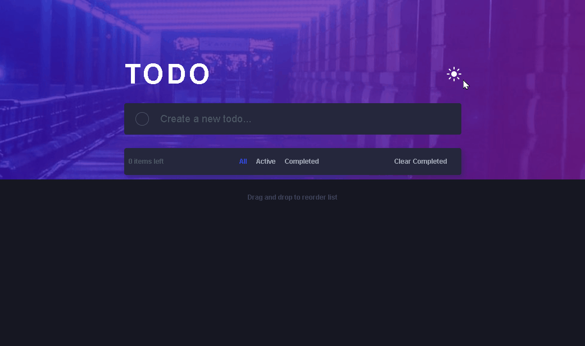
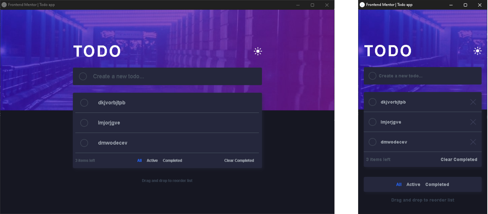

# 🖥️Frontend Mentor - Todo app

## 🚀Motivação

A pricipal e unica motivação de criação desse projeto foi, aprimoramento das habilidades pratricas em TailWindCSS...

## 🎮Habilidades

- HTML5

- CSS3

- TailwindCSS

- JavaScript

## 📋Descrição

- O projeto Foi desenvolvido durante 10 dias, tendo seu inicio em 28/02 e foi finalizado no dia 08/03...

- No seu desenvolvimeto fora utilizado, javaScript orientado a object POO..

- Fora usado localStorage para armazenar as quest do usario e o tema do navegado inicialmente, podendo se alterado ao clicar no botão de trocar tema, representado pela 🌑lua e ☀️sol, ambos representado modo escuro e claro, respectivamente...

- A pagina fora feita responsiva, indo do modo 🖥️desktop ao 📱mobile...

## 🥳Conclusão

Esse projeto foi uma forma de "sentir na pele", como e usar o tailwindcss na pratica, tanto na sua aplicação simples até na criação de estilo personalizado, responsividade e estado Ex: hover, focus. Contudo sei que, não vai ser na primeira vez que vou conseguir usa-lo com excelencia, tendo em vista a vasta quantidade de classes tailwind para se referir a um atributos predefinido css, terei como foco não a memorização como objetivo principal mas sim, a pratica com a ferramenta, para ao passar do tempo me familializar mais e mais com ela.

## 🤟Agradecimento

Agradeço a todo que chegarão até aqui e sinta-se a vontade para deixar um feedback, até mais.